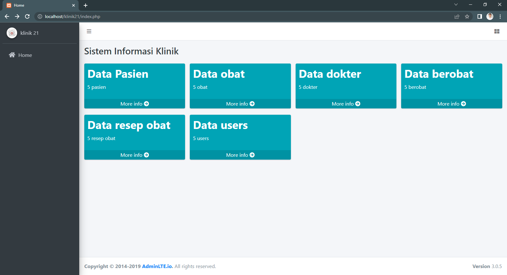

# TUGAS 6

- Nama : Zikri Hadiansyah
- Nim : 312010069
- Kelas : TI.20.D.1
- Matkul : Sistem Basis Data

# Soal

- Pisahkan per table, buat halaman home untuk menampilkan jumlah data

# Jawaban

- Halaman Home :
  

- Tabel Pasien
  

- Tabel obat
  

- Tabel dokter
  

- Tabel berobat
  

- Tabel resep obat
  

- Tabel users
  
